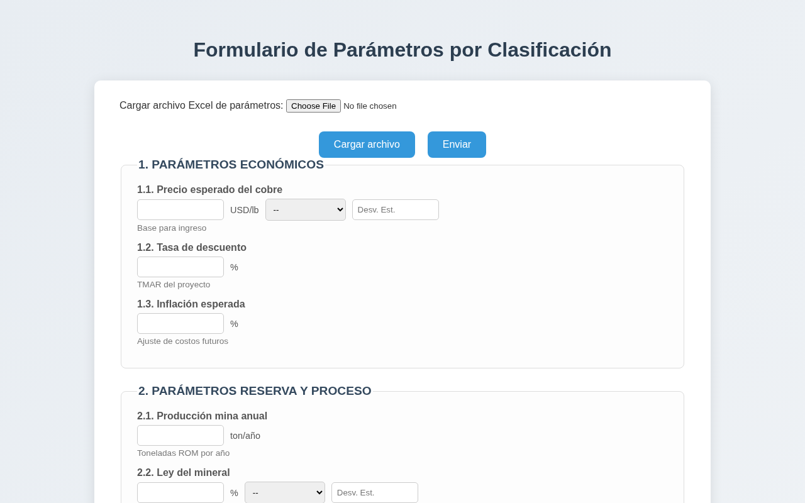
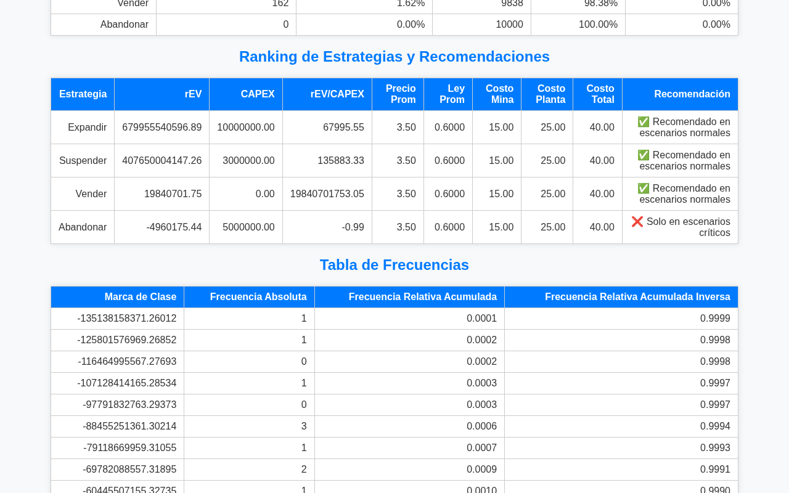

## 🏗 **Adapvector - Simulación de Estrategias Mineras**

Este proyecto es una aplicación web en **Flask** que permite cargar parámetros, realizar simulaciones y analizar estrategias para proyectos mineros.



---

## 🚀 **Cómo iniciar el proyecto**

### 1️⃣ **Instala Python**

Asegúrate de tener **Python 3.x** instalado.
Puedes descargarlo desde: [https://www.python.org/downloads/](https://www.python.org/downloads/)

⚠ Durante la instalación, marca **"Add Python to PATH"**.

---

### 2️⃣ **Clona el repositorio**

```bash
git clone https://github.com/Snickmax/Adapvector.git
cd Adapvector
```

---

### 3️⃣ **Crea y activa el entorno virtual**

💻 En Windows:

```bash
pip install virtualenv
virtualenv venv
venv\Scripts\activate
```

💻 En Mac/Linux:

```bash
pip install virtualenv
virtualenv venv
source venv/bin/activate
```

---

### 4️⃣ **Instala las dependencias**

```bash
pip install -r requirements.txt
```

---

### 5️⃣ **Ejecuta la aplicación**

```bash
python run.py
```

La aplicación estará disponible en: [http://127.0.0.1:5000/](http://127.0.0.1:5000/)

---

## 📂 **Estructura del proyecto**

```
Adapvector/
├── app/                # Código fuente de la app Flask
│   ├── __init__.py
│   ├── routes.py
│   └── ...
├── templates/           # Plantillas HTML (Jinja2)
│   ├── index.html
│   └── resultados.html
├── static/              # Archivos estáticos (CSS, JS)
├── uploads/             # Archivo xlsx de prueba
├── db/                  # Base de datos y archivos dinámicos
├── docs/                # Capturas de pantalla
├── run.py               # Archivo para ejecutar la app
├── requirements.txt     # Dependencias del proyecto
├── .gitignore
└── README.md
```

---

## 📊 **Resultados**

Tras cargar los parámetros (por ejemplo desde `uploads/Inputs.xlsx`) y ejecutar la simulación Monte Carlo, la aplicación muestra estadísticas del VAN, gráficos, análisis de dominancia y un ranking de estrategias con recomendaciones:



---

## ⚠ **Notas**

✅ puedes cargar el archivo `Inputs.xlsx` de `uploads/`.

✅ La base de datos se genera automáticamente dentro de `db/`.

✅ El entorno virtual te mantiene las dependencias aisladas.

✅ No subas el contenido de `venv/`, `db/` o archivos de base de datos al repositorio.

---

## 🔭 **Trabajo futuro**

- Integrar **SimulAdapvector** como módulo de cronogramas, para complementar el análisis financiero de estrategias con la planificación temporal de las actividades del proyecto minero.

---